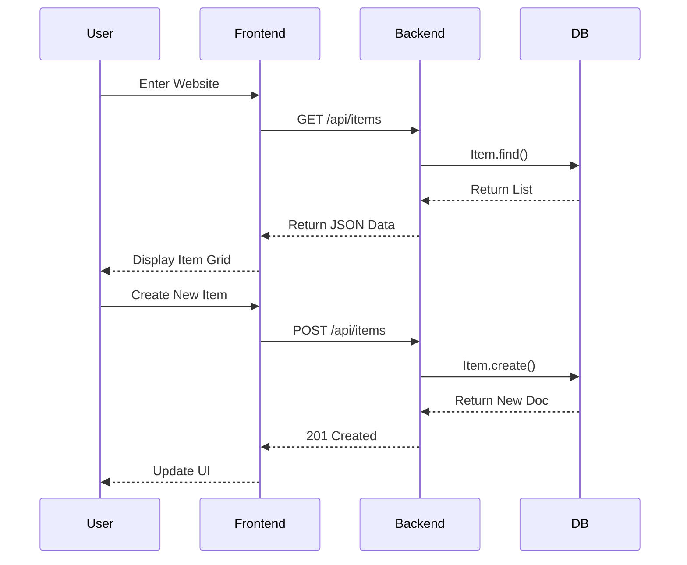

# System Architecture (系統架構)

## 架構圖 (Architecture Diagram)
```mermaid
graph TD
    User[使用者 User] -->|HTTP Request| Frontend[前端 React App (Vite)]
    Frontend -->|REST API (Axios)| Backend[後端 Express Server]
    Backend -->|Mongoose ODM| DB[(MongoDB Database)]
    
    subgraph Frontend Logic
        UI[UI Components]
        State[React State]
        Service[API Service]
        UI --> State
        State --> Service
    end

    subgraph Backend Logic
        Router[API Routes]
        Controller[Controllers]
        Model[Mongoose Models]
        Router --> Controller
        Controller --> Model
    end
```

## CRUD 流程圖 (Sequence Diagram)


## 資料流 (Data Flow)
1. **User Action**: 使用者在前端介面操作 (如點擊 "Add Item")。
2. **Frontend**: React 收集表單資料，透過 `api.js` 發送 POST 請求。
3. **Backend**: Express 接收請求，Controller 驗證資料。
4. **Database**: Mongoose 將資料寫入 MongoDB。
5. **Response**: 後端回傳成功訊息與新資料。
6. **UI Update**: 前端接收回應，更新 State 並重新渲染列表。
